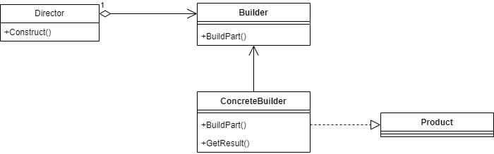

# Creational Design Patterns

## Builder Pattern

- Builder is useful when creating complex objects
- When object creation needs to be separate from its assembly
- When different representations need to be created with finer control

### Overview of the process

> If you have a class with a bunch of constructors, the Builder Pattern is likely a good alternative.

### Implications

- Lets you vary a products' internal representation
- It isolates code for construction and reprsentation
- It gives you finer control over the construction process
- Shares similarities with the Factory pattern
  - Builder pattern is focused on object creation using specific steps
  - Factory pattern is concerned of families/groups of objects created